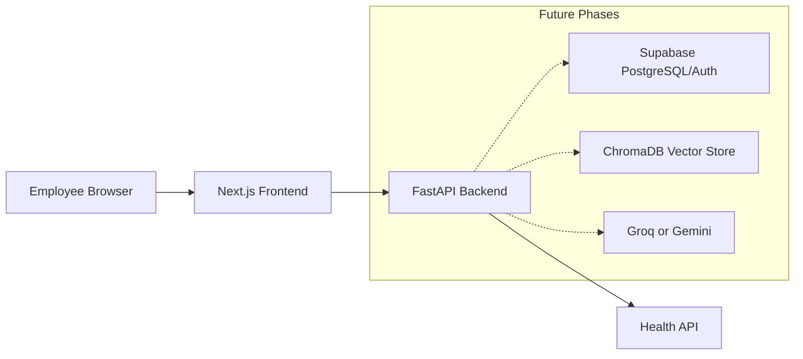

# Phase 1: Project Setup

## What We Are Building

We are creating a monorepo foundation for the Enterprise Knowledge Assistant.

A monorepo keeps the frontend, backend, infrastructure, and documentation in one version-controlled place. This makes it easier to coordinate API contracts, environment variables, deployment changes, and architecture documentation.

## Why It Is Needed

Enterprise AI applications usually fail when the foundation is messy:

- Secrets get scattered across machines.
- Frontend and backend API contracts drift.
- Local setup differs from production setup.
- Teams cannot tell where business logic belongs.

This phase creates a clean starting point before we add authentication, document upload, RAG, and agents.

## Initial Architecture



## Folder Structure

```text
enterprise-knowledge-assistant/
  frontend/                 Next.js application
  backend/                  FastAPI application
  docs/architecture/        Architecture notes and diagrams
  .env.example              Shared environment variable reference
  .gitignore                Files Git should ignore
  .editorconfig             Consistent editor formatting
  README.md                 Project overview and local setup
```

## Technologies Introduced

Next.js:
React framework used for production web applications. We use it because it supports routing, server rendering, API integration, and deployment to Vercel.

TypeScript:
Adds static typing to JavaScript. Companies use it because it catches many bugs before runtime and improves team collaboration.

Tailwind CSS:
Utility-first CSS framework. We use it for fast, consistent UI development without inventing a custom CSS system too early.

FastAPI:
Python web framework for APIs. It is commonly used in AI systems because it integrates well with Python ML libraries and provides automatic OpenAPI docs.

Pydantic:
Validation library used by FastAPI. It helps ensure API inputs and outputs have predictable shapes.

Uvicorn:
ASGI server that runs FastAPI locally and in production-like environments.

## Files Created

- `README.md`
- `.env.example`
- `.gitignore`
- `.editorconfig`
- `docs/architecture/phase-01-project-setup.md`
- `frontend/package.json`
- `frontend/next.config.ts`
- `frontend/tsconfig.json`
- `frontend/postcss.config.mjs`
- `frontend/tailwind.config.ts`
- `frontend/app/layout.tsx`
- `frontend/app/page.tsx`
- `frontend/app/globals.css`
- `backend/pyproject.toml`
- `backend/requirements.txt`
- `backend/app/main.py`
- `backend/app/core/config.py`
- `backend/app/api/health.py`
- `backend/tests/test_health.py`

## Commands To Run

From the workspace root:

```powershell
cd enterprise-knowledge-assistant
```

Install and run the frontend:

```powershell
cd frontend
npm.cmd install
npm.cmd run dev
```

Run the backend after installing Python 3.11+:

```powershell
cd ..\backend
python -m venv .venv
.\.venv\Scripts\Activate.ps1
python -m pip install --upgrade pip
pip install -r requirements.txt
uvicorn app.main:app --reload --host 0.0.0.0 --port 8000
```

Run backend tests:

```powershell
pytest
```

## Expected Outputs

Frontend:

```text
Local: http://localhost:3000
```

Backend health check:

```json
{
  "status": "ok",
  "service": "enterprise-knowledge-assistant-api",
  "environment": "development"
}
```

Backend docs:

```text
http://localhost:8000/docs
```

## How To Test

1. Open `http://localhost:3000`.
2. Confirm the page renders the project name and current phase.
3. Open `http://localhost:8000/health`.
4. Confirm the JSON response returns `"status": "ok"`.
5. Open `http://localhost:8000/docs`.
6. Confirm Swagger UI is visible.
7. Run `pytest` from the `backend` folder.

## Common Errors

PowerShell blocks `npm`:

```text
npm.ps1 cannot be loaded because running scripts is disabled
```

Use:

```powershell
npm.cmd install
```

Python is not installed:

```text
No installed Python found
```

Install Python 3.11+ and check:

```powershell
python --version
```

Port already in use:

```text
Address already in use
```

Use a different port:

```powershell
uvicorn app.main:app --reload --port 8001
```

