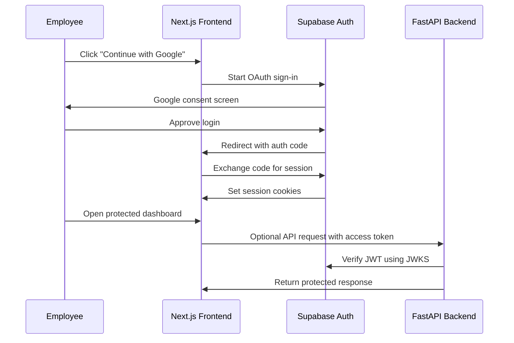

# Phase 2: Authentication

## What We Are Building

We are adding authentication foundations with Supabase Auth and Google Login.

In this phase, users can start a Google OAuth sign-in from the frontend. Supabase manages the OAuth flow, stores the session in secure cookies through the Next.js server-side rendering helper, and protects private routes. The backend receives Supabase JWTs as bearer tokens and verifies them before returning protected API data.

## Why It Is Needed

An enterprise knowledge assistant must know who is asking a question before it can decide what documents that person is allowed to access. Authentication is the first security boundary.

We are not adding role-based authorization yet. That comes later after the database schema exists.

## Authentication Architecture



## Folder Structure

```text
frontend/
  app/
    auth/
      callback/
        route.ts
      login/
        page.tsx
    dashboard/
      actions.ts
      page.tsx
  lib/
    env.ts
    supabase/
      browser.ts
      middleware.ts
      server.ts
  middleware.ts

backend/
  app/
    api/
      auth.py
    core/
      auth.py
      config.py
```

## Files Created Or Updated

- `frontend/lib/env.ts`
- `frontend/lib/supabase/browser.ts`
- `frontend/lib/supabase/server.ts`
- `frontend/lib/supabase/middleware.ts`
- `frontend/middleware.ts`
- `frontend/app/auth/login/page.tsx`
- `frontend/app/auth/callback/route.ts`
- `frontend/app/dashboard/page.tsx`
- `frontend/app/dashboard/actions.ts`
- `backend/app/core/auth.py`
- `backend/app/api/auth.py`
- `docs/dependencies.md`
- `frontend/package-lock.json`
- `backend/requirements-lock.txt`

## Commands To Run

Install frontend dependencies:

```powershell
cd frontend
npm.cmd install
```

Install backend dependencies:

```powershell
cd backend
python -m venv .venv
.\.venv\Scripts\Activate.ps1
python -m pip install --upgrade pip
pip install -r requirements.txt
```

Run frontend:

```powershell
npm.cmd run dev
```

Run backend:

```powershell
uvicorn app.main:app --reload --host 0.0.0.0 --port 8000
```

## Supabase Setup

1. Create a Supabase project.
2. Open Authentication.
3. Enable Google as an OAuth provider.
4. Add the Google client ID and secret.
5. Add this redirect URL in Supabase:

```text
http://localhost:3000/auth/callback
```

6. Copy Supabase URL and anon key into `.env`.

## Expected Outputs

Login page:

```text
http://localhost:3000/auth/login
```

Protected dashboard:

```text
http://localhost:3000/dashboard
```

Backend protected endpoint:

```text
GET http://localhost:8000/auth/me
Authorization: Bearer <supabase-access-token>
```

Without a token, the backend returns:

```json
{
  "detail": "Missing bearer token"
}
```

## How To Test

1. Start the frontend.
2. Open `/dashboard` while logged out.
3. Confirm you are redirected to `/auth/login`.
4. Click Google login after configuring Supabase.
5. Confirm Supabase redirects back to `/auth/callback`.
6. Confirm you land on `/dashboard`.
7. Start the backend.
8. Request `/auth/me` without a token and confirm it returns `401`.

## Common Errors

Missing frontend env values:

```text
Missing NEXT_PUBLIC_SUPABASE_URL
```

Fix by copying `.env.example` to `.env.local` inside `frontend` or by setting environment variables in the shell.

OAuth redirect mismatch:

```text
redirect_uri_mismatch
```

Fix by adding `http://localhost:3000/auth/callback` to Supabase and Google OAuth redirect settings.

Backend token verification fails:

```text
Invalid or expired token
```

Confirm that `SUPABASE_URL` in the backend environment points to the same Supabase project that issued the token.
