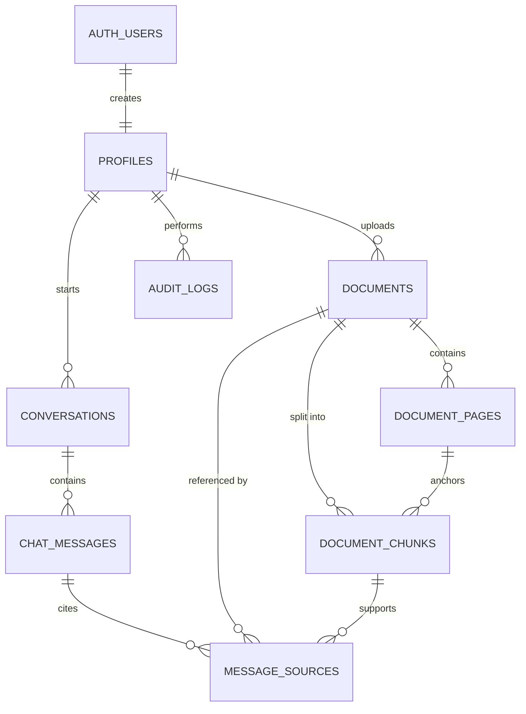

# Phase 3: Database Schema

## What We Are Building

We are creating the relational database schema in Supabase PostgreSQL.

The schema stores users, roles, document metadata, parsed pages, chunks, chat conversations, citations, and audit logs. The vector database comes later in ChromaDB; PostgreSQL remains the source of truth for business data and access control.

## Why It Is Needed

RAG systems need more than embeddings. A production enterprise assistant needs to know:

- Who uploaded a document.
- Which department owns it.
- Whether it is ready for search.
- Which chunks came from which page.
- Which sources were cited in an answer.
- Which user asked which question.
- Which actions happened for audit and compliance.

PostgreSQL is used for structured, transactional, auditable data. ChromaDB will be used later for vector similarity search.

## Database ER Diagram



## Table Responsibilities

`profiles`:
Stores application-level user details and role. Supabase owns authentication in `auth.users`; our app owns business profile data in `public.profiles`.

`documents`:
Stores metadata about uploaded company files. The actual file bytes will live in storage later.

`document_pages`:
Stores extracted PDF page text after parsing.

`document_chunks`:
Stores chunked text that will later be embedded and indexed into ChromaDB.

`conversations`:
Groups chat messages for a user.

`chat_messages`:
Stores user and assistant messages.

`message_sources`:
Stores citations that connect assistant answers back to source documents and chunks.

`audit_logs`:
Stores important security and compliance events.

## Folder Structure

```text
supabase/
  README.md
  migrations/
    0001_initial_schema.sql

backend/
  app/
    db/
      supabase.py
    schemas/
      profile.py
```

## Files Created Or Updated

- `supabase/migrations/0001_initial_schema.sql`
- `supabase/README.md`
- `docs/architecture/phase-03-database-schema.md`
- `backend/app/db/supabase.py`
- `backend/app/schemas/profile.py`
- `backend/app/api/auth.py`
- `backend/app/core/config.py`
- `backend/requirements.txt`
- `backend/requirements-lock.txt`
- `README.md`

## Commands To Run

Install updated backend dependencies:

```powershell
cd backend
.\.venv\Scripts\Activate.ps1
pip install -r requirements.txt
```

Run backend checks:

```powershell
ruff check .
pytest
```

Apply the schema in Supabase:

```text
Supabase Dashboard -> SQL Editor -> paste supabase/migrations/0001_initial_schema.sql -> Run
```

## Expected Outputs

After running the SQL migration, Supabase Table Editor should show:

```text
profiles
documents
document_pages
document_chunks
conversations
chat_messages
message_sources
audit_logs
```

Supabase should also show row-level security enabled for all application tables.

## How To Test

Run this in Supabase SQL Editor:

```sql
select table_name
from information_schema.tables
where table_schema = 'public'
  and table_name in (
    'profiles',
    'documents',
    'document_pages',
    'document_chunks',
    'conversations',
    'chat_messages',
    'message_sources',
    'audit_logs'
  )
order by table_name;
```

Expected result:

```text
audit_logs
chat_messages
conversations
document_chunks
document_pages
documents
message_sources
profiles
```

## Common Errors

Permission error when creating trigger on `auth.users`:

```text
permission denied for schema auth
```

Run the SQL from the Supabase Dashboard SQL Editor, not from the frontend or anon client.

Duplicate object error:

```text
type already exists
```

The migration guards enum creation, but if you manually edited the schema before, confirm the enum values match.

RLS blocks expected reads:

```text
new row violates row-level security policy
```

That is expected unless the request is authenticated and satisfies the policy. Service-role backend operations can bypass RLS, but the service-role key must stay server-side.

