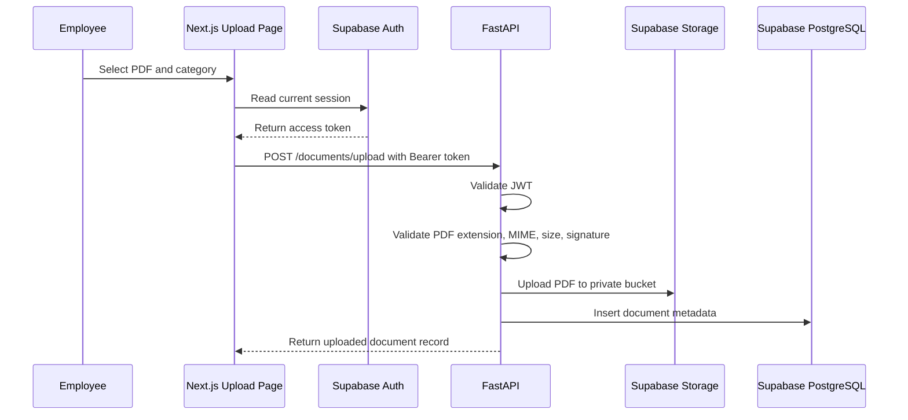

# Phase 4: Document Upload System

## What We Are Building

We are adding the first document ingestion capability.

Employees can upload PDF files from the frontend. The frontend sends the user's Supabase access token to FastAPI. The backend validates the file, uploads it to a private Supabase Storage bucket, and stores document metadata in PostgreSQL.

PDF parsing is not part of this phase. That comes next.

## Why It Is Needed

A knowledge assistant cannot answer from company documents until documents enter the system safely. Upload is the first ingestion boundary, so it must validate file type, limit file size, avoid unsafe filenames, store files privately, and create metadata for later processing.

## Upload Workflow



## Folder Structure

```text
backend/
  app/
    api/
      documents.py
    repositories/
      document_repository.py
      storage_repository.py
    schemas/
      document.py
    services/
      document_service.py
    tests/
      test_document_service.py

frontend/
  app/
    documents/
      upload/
        page.tsx
        upload-document-form.tsx

supabase/
  migrations/
    0002_document_storage_bucket.sql
```

## Files Created Or Updated

- `backend/app/api/documents.py`
- `backend/app/services/document_service.py`
- `backend/app/repositories/document_repository.py`
- `backend/app/repositories/storage_repository.py`
- `backend/app/schemas/document.py`
- `backend/tests/test_document_service.py`
- `frontend/app/documents/upload/page.tsx`
- `frontend/app/documents/upload/upload-document-form.tsx`
- `frontend/app/dashboard/page.tsx`
- `supabase/migrations/0002_document_storage_bucket.sql`
- `backend/requirements.txt`
- `backend/requirements-lock.txt`

## Commands To Run

Install backend dependencies:

```powershell
cd backend
.\.venv\Scripts\Activate.ps1
pip install -r requirements.txt
```

Run backend:

```powershell
uvicorn app.main:app --reload --host 0.0.0.0 --port 8000
```

Run frontend:

```powershell
cd frontend
npm.cmd run dev
```

Apply the storage migration:

```text
Supabase Dashboard -> SQL Editor -> paste supabase/migrations/0002_document_storage_bucket.sql -> Run
```

## Expected Outputs

Backend upload endpoint:

```text
POST http://localhost:8000/documents/upload
```

Frontend upload page:

```text
http://localhost:3000/documents/upload
```

Successful response:

```json
{
  "message": "Document uploaded successfully and is waiting for parsing.",
  "document": {
    "status": "uploaded"
  }
}
```

## How To Test

1. Apply Phase 3 and Phase 4 SQL migrations in Supabase.
2. Start backend and frontend.
3. Sign in once Google OAuth is configured.
4. Open `/documents/upload`.
5. Upload a PDF smaller than 10 MB.
6. Confirm a row appears in the `documents` table.
7. Confirm the file appears in the private `company-documents` storage bucket.

Run automated checks:

```powershell
cd backend
ruff check .
pytest
```

```powershell
cd frontend
npm.cmd run type-check
npm.cmd run build
```

## Common Errors

Missing backend service-role key:

```text
Supabase admin client is not configured
```

Fix `backend/.env` and set `SUPABASE_SERVICE_ROLE_KEY`.

Bucket missing:

```text
Bucket not found
```

Run `0002_document_storage_bucket.sql` in Supabase SQL Editor.

Upload blocked:

```text
File must use application/pdf content type
```

Upload a real PDF from the browser. Some manually renamed files are not valid PDFs.

Unauthorized:

```text
Missing bearer token
```

The frontend user must be signed in before uploading.
