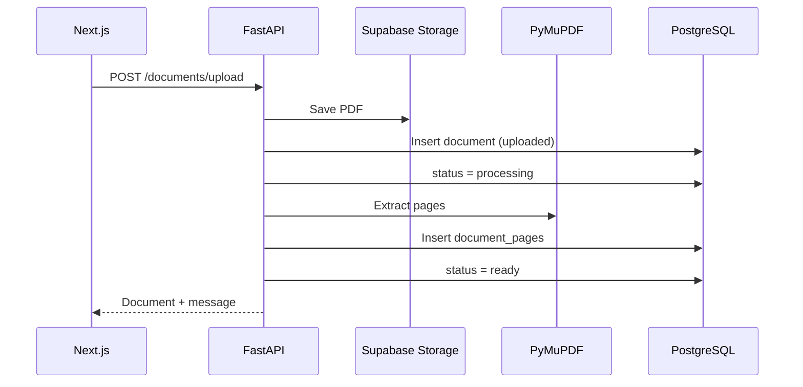

# Phase 5: PDF Parsing

## What We Are Building

After upload, the backend extracts text from each PDF page using **PyMuPDF** and stores it in the `document_pages` table. Document status moves through `uploaded` → `processing` → `ready` or `failed`.

## Why It Is Needed

RAG and agents need searchable text. PDFs are binary files; parsing converts them into structured page text for chunking and embeddings in later phases.

## Parsing Workflow



## API Endpoints

| Method | Path | Description |
|--------|------|-------------|
| POST | `/documents/upload` | Upload + auto-parse |
| POST | `/documents/{id}/parse` | Re-parse existing document |
| GET | `/documents/{id}` | Document + extracted pages |

## Commands

```powershell
cd backend
.\.venv\Scripts\Activate.ps1
pip install -r requirements.txt
uvicorn app.main:app --reload --port 8000
```

```powershell
cd frontend
npm.cmd run dev
```

## How To Test

1. Upload a text-based PDF at `/documents/upload`.
2. Confirm status becomes **ready** on `/documents`.
3. Open **View pages** and confirm extracted text per page.
4. For older `uploaded` documents, open detail and click **Run parsing**.

## Common Errors

| Error | Fix |
|-------|-----|
| Status `failed` — no extractable text | PDF may be scanned images; OCR is a future enhancement |
| `processing` stuck | Restart backend; use **Retry parsing** |
| Import error `fitz` | Run `pip install pymupdf` in backend venv |
