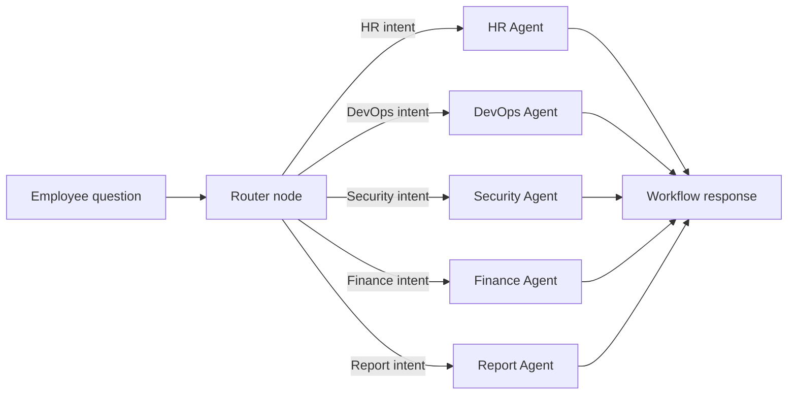

# Phase 14: LangGraph Multi-Agent Workflow

## What We Are Building

We are replacing the simple router concept with a LangGraph workflow.

The workflow has a router node and specialist nodes:

- Router node
- HR agent node
- DevOps agent node
- Security agent node
- Finance agent node
- Report agent node

The router chooses one specialist, then LangGraph executes that specialist node and returns an execution trace.

## Why It Is Needed

Simple function calls are enough for early prototypes. Production agent systems need explicit workflow structure because teams need to inspect routing, add retries, branch logic, state, logging, guardrails, and human review steps.

LangGraph gives us a graph-based orchestration layer for that. It turns agent execution into nodes and edges instead of a hidden chain of function calls.

## Agent Workflow Diagram



## API Specification

```text
POST /api/agents/workflow
Authorization: Bearer <supabase-access-token>
Content-Type: application/json
```

Request:

```json
{
  "query": "How do I submit reimbursement requests?"
}
```

Response:

```json
{
  "query": "How do I submit reimbursement requests?",
  "selected_agent": "finance",
  "agent_name": "FinanceAgent",
  "answer": "...",
  "sources": [],
  "trace": [
    "router:selected:finance",
    "specialist:executed:FinanceAgent"
  ]
}
```

## Folder Structure

```text
backend/
  app/
    agents/
      langgraph_workflow.py
    api/
      agents.py
    schemas/
      agent_workflow.py
    tests/
      test_langgraph_workflow.py
```

## Files Created Or Updated

- `backend/app/agents/langgraph_workflow.py`
- `backend/app/api/agents.py`
- `backend/app/schemas/agent_workflow.py`
- `backend/tests/test_langgraph_workflow.py`
- `backend/app/main.py`
- `backend/requirements-lock.txt`

## Commands To Run

Install dependencies:

```powershell
cd backend
.\.venv\Scripts\Activate.ps1
pip install -r requirements.txt
```

Run backend:

```powershell
uvicorn app.main:app --reload --host 0.0.0.0 --port 8000
```

Run checks:

```powershell
ruff check .
pytest
```

## Expected Outputs

Calling `/api/agents/workflow` with a finance question should return:

```text
selected_agent: finance
agent_name: FinanceAgent
```

Calling it with a password/access question should return:

```text
selected_agent: security
agent_name: SecurityAgent
```

## How To Test

Run:

```powershell
pytest tests/test_langgraph_workflow.py
```

Then call the API while the backend is running.

## Common Errors

Missing package:

```text
ModuleNotFoundError: No module named 'langgraph'
```

Run:

```powershell
pip install -r requirements.txt
```

Unauthorized:

```text
Missing bearer token
```

Use a logged-in frontend session or development auth bypass.

