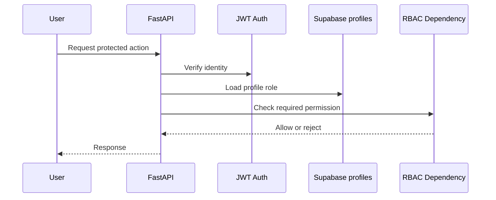

# Phase 15: Role-Based Access Control

## What We Are Building

We are adding backend role-based access control using the `profiles.role` column from Supabase PostgreSQL.

Authentication proves who the user is. Authorization decides what that user can do.

## Why It Is Needed

Enterprise assistants handle sensitive company policies. HR, Finance, Security, DevOps, admins, and employees should not all have the same permissions.

RBAC gives us a central permission model for document management, admin actions, and future dashboards.

## Role Model

```text
employee
hr_admin
devops_admin
security_admin
finance_admin
admin
```

## Permission Rules Added

```text
employee       Can upload general documents
hr_admin       Can manage HR documents
devops_admin   Can manage DevOps and technical documents
security_admin Can manage security documents
finance_admin  Can manage finance documents
admin          Can manage all document categories and user roles
```

## RBAC Workflow



## Files Created Or Updated

- `backend/app/core/rbac.py`
- `backend/app/api/auth.py`
- `backend/app/api/documents.py`
- `backend/app/repositories/profile_repository.py`
- `backend/app/schemas/profile.py`
- `backend/tests/test_rbac.py`

## API Specification

Admin-only list profiles:

```text
GET /auth/profiles
```

Admin-only update role:

```text
PATCH /auth/profiles/{user_id}/role
```

Request:

```json
{
  "role": "finance_admin"
}
```

## Commands To Run

```powershell
cd backend
.\.venv\Scripts\Activate.ps1
ruff check .
pytest
```

## Expected Outputs

Unauthorized role changes return:

```json
{
  "detail": "Insufficient role permissions"
}
```

Invalid document-category management returns:

```json
{
  "detail": "Role employee cannot manage hr documents"
}
```

## How To Test

Run:

```powershell
pytest tests/test_rbac.py
```

Then use Supabase Table Editor to set your profile role to `admin` if you want to test admin APIs manually.

## Common Errors

Profile missing:

```text
User profile could not be loaded
```

Confirm Phase 3 migrations were applied and the `profiles` table exists.

Forbidden:

```text
Insufficient role permissions
```

Your profile exists, but your `profiles.role` does not allow that action.

