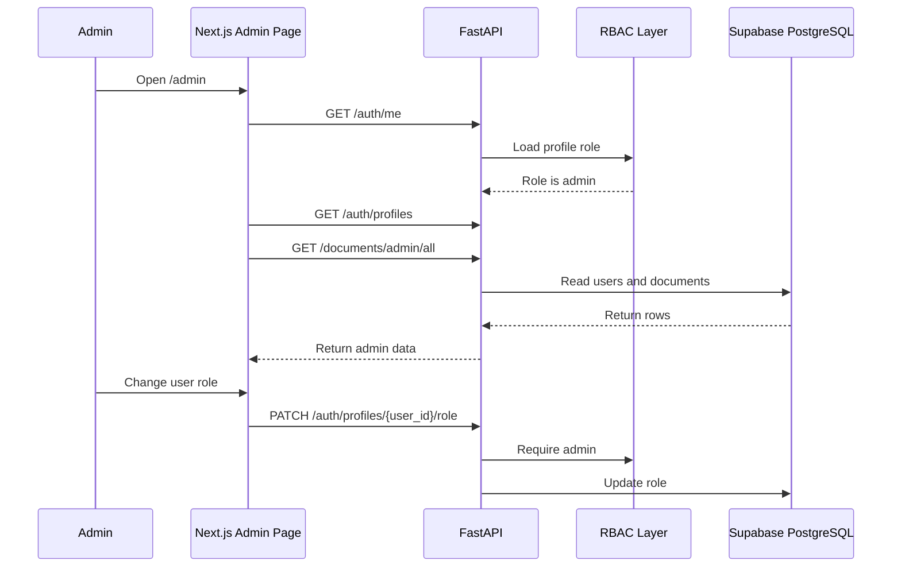

# Phase 16: Admin Dashboard

## What We Are Building

We are adding an admin dashboard for operational control.

Admins can:

- View users and roles.
- Change user roles.
- Inspect uploaded documents.
- See document ingestion status.

## Why It Is Needed

RBAC is not useful if administrators must edit database rows manually. Companies need controlled internal tools for user and document operations.

The dashboard is intentionally backed by the same FastAPI RBAC APIs. The frontend does not invent permissions; it asks the backend.

## Admin Dashboard Workflow



## API Specification

List profiles:

```text
GET /auth/profiles
Authorization: Bearer <token>
```

Update role:

```text
PATCH /auth/profiles/{user_id}/role
Authorization: Bearer <token>
Content-Type: application/json
```

Request:

```json
{
  "role": "finance_admin"
}
```

List all documents:

```text
GET /documents/admin/all
Authorization: Bearer <token>
```

## Folder Structure

```text
frontend/
  app/
    admin/
      actions.ts
      page.tsx
  lib/
    api/
      admin.ts

backend/
  app/
    api/
      auth.py
      documents.py
    repositories/
      document_repository.py
```

## Files Created Or Updated

- `frontend/app/admin/page.tsx`
- `frontend/app/admin/actions.ts`
- `frontend/lib/api/admin.ts`
- `frontend/app/dashboard/page.tsx`
- `backend/app/api/documents.py`
- `backend/app/repositories/document_repository.py`
- `backend/tests/test_rbac.py`

## Commands To Run

Backend checks:

```powershell
cd backend
.\.venv\Scripts\Activate.ps1
ruff check .
pytest
```

Frontend checks:

```powershell
cd frontend
npm.cmd run type-check
npm.cmd run build
```

Run locally:

```powershell
npm.cmd run dev
```

```powershell
uvicorn app.main:app --reload --host 0.0.0.0 --port 8000
```

## Expected Outputs

Admin page:

```text
http://localhost:3000/admin
```

Admin users can see users, roles, metrics, and documents.

Non-admin users see:

```text
Admin role required
```

## How To Test

1. Apply database migrations.
2. Set your row in `profiles.role` to `admin`.
3. Start frontend and backend.
4. Open `/admin`.
5. Change another user's role.
6. Refresh Supabase Table Editor and confirm `profiles.role` changed.

## Common Errors

Forbidden:

```text
Insufficient role permissions
```

Your profile is not `admin`.

Profile load failure:

```text
User profile could not be loaded
```

Confirm Supabase keys are configured and the `profiles` table exists.

Backend unreachable:

```text
Admin dashboard could not be loaded
```

Start FastAPI on port 8000.

