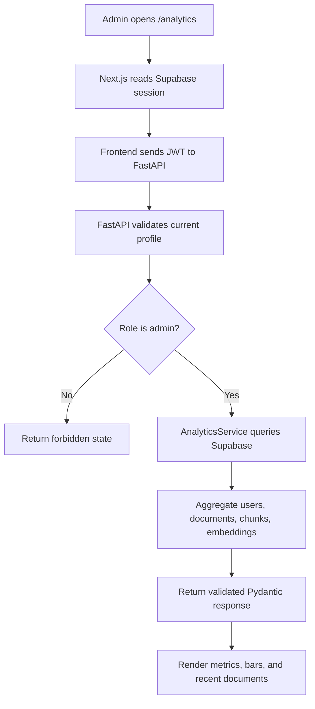

# Phase 17: Analytics Dashboard

## What We Are Building

Phase 17 adds an admin-only analytics dashboard for the Enterprise Knowledge Assistant.

The dashboard answers operational questions:

- How many employees are active?
- How many documents are uploaded?
- How many documents are ready for RAG?
- How many chunks and embeddings exist?
- Which document categories are used most?
- Which uploads recently entered the ingestion pipeline?

## Why It Is Needed

Enterprise AI systems need observability. A knowledge assistant is only useful when documents are uploaded, parsed, chunked, embedded, and indexed successfully. Analytics helps admins detect ingestion failures, low adoption, missing categories, and storage growth.

## Technology Used

- FastAPI exposes a protected analytics API.
- Supabase PostgreSQL stores users, documents, chunks, and embeddings.
- Pydantic validates the analytics response shape.
- Next.js renders the admin-only analytics dashboard.
- Tailwind CSS renders responsive cards, tables, and lightweight bar charts.
- Supabase Auth provides the JWT used to authorize analytics access.

## Folder Structure

```text
backend/
  app/
    api/
      analytics.py
    schemas/
      analytics.py
    services/
      analytics_service.py
  tests/
    test_analytics.py

frontend/
  app/
    analytics/
      page.tsx
    admin/
      page.tsx
    dashboard/
      page.tsx
  lib/
    api/
      admin.ts

docs/
  architecture/
    phase-17-analytics-dashboard.md
```

## Files Created

- `backend/app/api/analytics.py`
- `backend/app/schemas/analytics.py`
- `backend/app/services/analytics_service.py`
- `backend/tests/test_analytics.py`
- `frontend/app/analytics/page.tsx`
- `docs/architecture/phase-17-analytics-dashboard.md`

## Files Updated

- `backend/app/main.py`
- `frontend/lib/api/admin.ts`
- `frontend/app/dashboard/page.tsx`
- `frontend/app/admin/page.tsx`

## API Specification

### Get Admin Analytics Overview

```http
GET /analytics/admin/overview
Authorization: Bearer <supabase_access_token>
```

Only users with `profiles.role = admin` can access this endpoint.

Response:

```json
{
  "total_users": 4,
  "active_users": 4,
  "inactive_users": 0,
  "total_documents": 5,
  "ready_documents": 5,
  "failed_documents": 0,
  "processing_documents": 0,
  "uploaded_documents": 0,
  "archived_documents": 0,
  "total_storage_bytes": 462641,
  "total_chunks": 120,
  "total_embeddings": 120,
  "readiness_rate": 100,
  "category_breakdown": [],
  "status_breakdown": [],
  "role_breakdown": [],
  "recent_documents": []
}
```

## Analytics Workflow



## Commands To Run

Backend:

```bash
cd backend
python -m pytest
python -m ruff check .
```

Frontend:

```bash
cd frontend
npm run type-check
npm run build
npm run dev
```

## Expected Outputs

Backend tests:

```text
24 passed
```

Frontend type-check:

```text
tsc --noEmit
```

Frontend app:

```text
http://localhost:3000/analytics
```

## How To Test

1. Start the backend on port `8000`.
2. Start the frontend on port `3000`.
3. Log in to the app.
4. Make sure your Supabase `profiles.role` is `admin`.
5. Open `/analytics`.
6. Confirm metric cards, bar charts, and recent documents load.

## Common Errors

### 403 Forbidden

Your logged-in user is not an admin.

Fix:

```text
Supabase -> Table Editor -> profiles -> set role = admin
```

### User profile could not be loaded

The backend cannot find or create the profile row.

Check:

- Backend is running.
- Supabase URL and service role key are correct.
- `profiles` table exists.
- The logged-in user has a matching profile.

### Analytics shows zero documents

There may be no documents in Supabase yet, or the backend is using development fallback mode because Supabase failed.

Check:

- Backend terminal logs.
- `documents` table rows.
- `NEXT_PUBLIC_API_BASE_URL`.
- `SUPABASE_SERVICE_ROLE_KEY`.

## External Setup Needed

No new external service is required for Phase 17.

You only need Supabase configured from earlier phases:

- Supabase project URL
- Supabase anon key
- Supabase service role key
- `profiles`, `documents`, `document_chunks`, and `chunk_embeddings` tables
- Your user role set to `admin`
